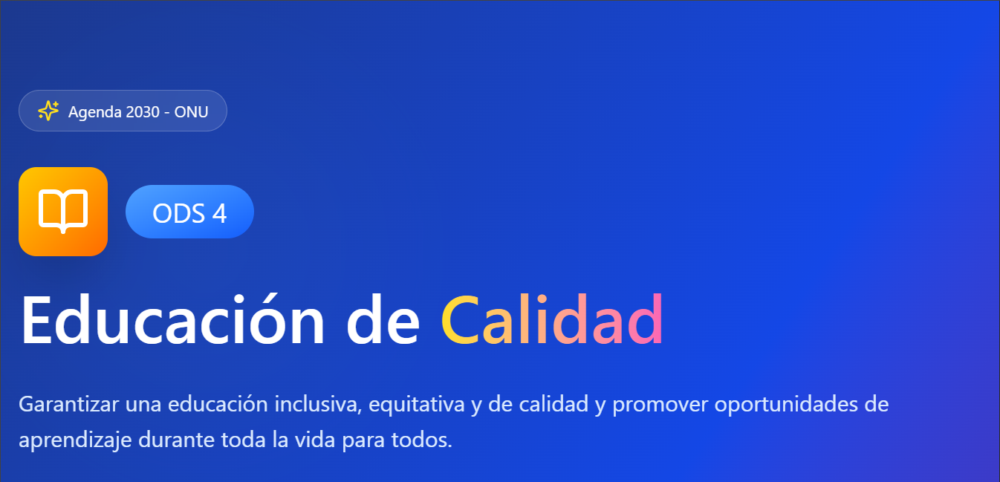

# Reto-ODS4-WebSostenible
## 2. Arquitectura de la Solución Web (Responsable: Alumno B)

### Nombre de la Aplicación
> **[Escolarizacion como estilo de vida]**

### Funcionalidades Principales
1. [cite_start]**Funcionalidad 1:** [Ejemplo: Registro de alumnos y profesores con perfiles específicos][cite: 47].
2. [cite_start]**Funcionalidad 2:** [Ejemplo: Chat de bajas emisiones de datos para consultas rápidas][cite: 48].
3. [cite_start]**Funcionalidad 3:** [Ejemplo: Repositorio de materiales educativos en formato de texto ligero][cite: 49].

### Entidades de Datos Básicas
| Entidad | Descripción | Ejemplo de datos a guardar |
| :--- | :--- | :--- |
| Usuarios | [cite_start]Personas registradas en la plataforma[cite: 28]. | [cite_start]ID_Usuario, Nombre, Email, Contraseña, Rol (Profe/Alumno)[cite: 28]. |
| Cursos | Contenidos o materias disponibles. | ID_Curso, Título, Descripción, ID_Profesor. |
| Materiales | Documentos o recursos para estudiar. | ID_Material, Nombre_Archivo, Tipo, ID_Curso. |

### Prototipo de Interfaz (Frontend)
A continuación se muestra el wireframe de nuestra aplicación:

